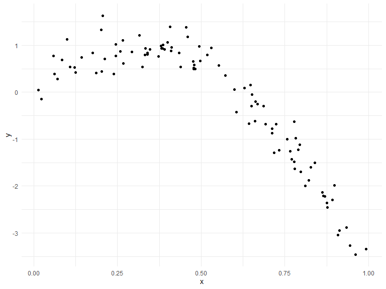
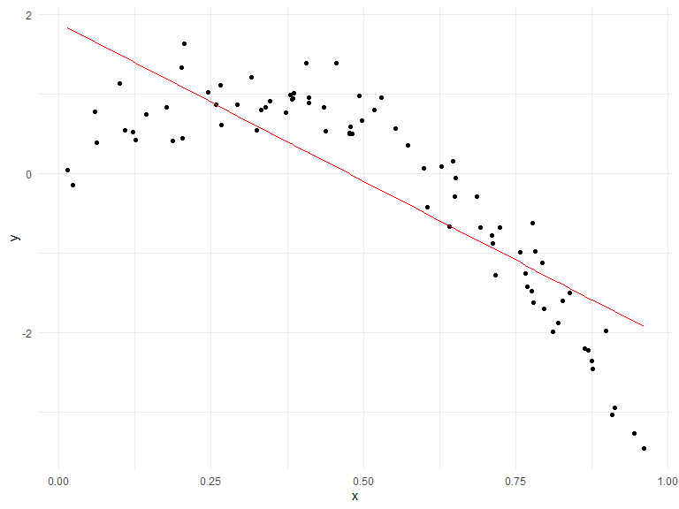
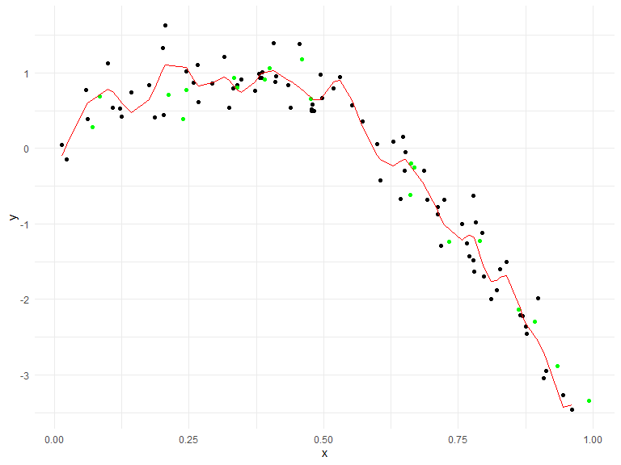

Cross Validation
================

## Step one

Cross validation “by hand” on simulated data.

runif -\> random uniform distribution adding runif so that x and y have
a non linear relationship

``` r
set.seed(1)

nonlin_df = 
  tibble(
    id = 1:100,
    x = runif(100, 0, 1),
    y = 1 - 10 * (x - .3) ^ 2 + rnorm(100, 0, .3)
  )

nonlin_df %>% 
  ggplot(aes(x = x, y = y)) + 
  geom_point()
```



Let’s get this by hand.

can also do train_df %\>% arrange(id)to demo that you do not get
sequential rows

``` r
train_df = sample_n(nonlin_df, 80)
test_df = anti_join(nonlin_df, train_df, by = "id")
```

*overlaying your two datasets*

``` r
train_df %>% 
  ggplot(aes(x = x, y = y)) + 
  geom_point() + 
  geom_point(data = test_df, color = "red")
```


Let’s try to fit three models.

- have nothing to do with my testing data

linear model should not be complex enough/ was constructed to not fix; y
= x smooth = just right; gam function y = smooth function of x (smooth -
fit) - treating x as there is some non linearity wiggly = too wild’
breaking the nonlinearity / adding too much nonlinearity k = X = 30, sp
= 10e - 6 – telling you to NOT smooth things –\> make sure it is very
wiggly

``` r
linear_mod = lm(y ~ x, data = train_df)
smooth_mod = mgcv::gam(y ~ s(x), data = train_df)
wiggly_mod = mgcv::gam(y ~ s(x, k = 30), sp = 10e-6, data = train_df)
```

Let’s see the results.

Note: mgcv does smooth fits

``` r
train_df %>% 
  add_predictions(linear_mod) %>% 
  ggplot(aes(x = x, y = y)) + 
  geom_point() + 
  geom_line(aes(y = pred), color = "red")
```



``` r
train_df %>% 
  add_predictions(smooth_mod) %>% 
  ggplot(aes(x = x, y = y)) + 
  geom_point() + 
  geom_point(data = test_df, color = "red") + 
  geom_line(aes(y = pred), color = "red")
```


``` r
train_df %>% 
  add_predictions(wiggly_mod) %>% 
  ggplot(aes(x = x, y = y)) + 
  geom_point() + 
  geom_point(data = test_df, color = "red") + 
  geom_line(aes(y = pred), color = "red")
```


Okay so how would you pick? Graphically clear choice. But now let;s be
less subjective (see parameters etc).

Let’s make predictions and compute RMSEs.

- we are adding predictions / to get fitted values based on the training
  data –\> get rmse

``` r
test_df %>% add_predictions(linear_mod)
```

    ## # A tibble: 20 × 4
    ##       id      x      y     pred
    ##    <int>  <dbl>  <dbl>    <dbl>
    ##  1     8 0.661  -0.615 -0.735  
    ##  2    18 0.992  -3.35  -2.05   
    ##  3    21 0.935  -2.89  -1.82   
    ##  4    22 0.212   0.710  1.05   
    ##  5    30 0.340   0.807  0.537  
    ##  6    36 0.668  -0.258 -0.766  
    ##  7    46 0.789  -1.23  -1.25   
    ##  8    49 0.732  -1.24  -1.02   
    ##  9    52 0.861  -2.14  -1.53   
    ## 10    55 0.0707  0.278  1.61   
    ## 11    59 0.662  -0.195 -0.740  
    ## 12    63 0.459   1.18   0.0659 
    ## 13    69 0.0842  0.683  1.55   
    ## 14    74 0.334   0.935  0.563  
    ## 15    75 0.476   0.659 -0.00274
    ## 16    76 0.892  -2.29  -1.65   
    ## 17    78 0.390   0.908  0.340  
    ## 18    83 0.400   1.06   0.300  
    ## 19    89 0.245   0.775  0.914  
    ## 20    91 0.240   0.389  0.937

\#Faster way to get RMSE

- RMSE is prediction error (you want lower)

``` r
rmse(linear_mod, test_df)
```

    ## [1] 0.7052956

``` r
rmse(smooth_mod, test_df)
```

    ## [1] 0.2221774

``` r
rmse(wiggly_mod, test_df)
```

    ## [1] 0.289051

## Can we iterate ..?

Let’s test to see if we can model this again – is this a fluke

crossv_mc – does not create a df it stores a df it just changes the row
\#s

``` r
cv_df = 
  crossv_mc(nonlin_df, 100)#do cross validation on my df 100x

cv_df %>% pull(train) %>% .[[1]] #pull out first element of your list of your training dataset
```

    ## <resample [79 x 3]> 1, 2, 3, 4, 6, 7, 8, 9, 10, 11, ...

``` r
#calling it a class of object resample in which you don't have to keep track of your dataframe and only keep track of which row is in your dataset (gives weird object)--> create into tibble (keeps track of all of your testing splits)

cv_df %>% pull(train) %>% .[[1]] %>% as_tibble
```

    ## # A tibble: 79 × 3
    ##       id      x       y
    ##    <int>  <dbl>   <dbl>
    ##  1     1 0.266   1.11  
    ##  2     2 0.372   0.764 
    ##  3     3 0.573   0.358 
    ##  4     4 0.908  -3.04  
    ##  5     6 0.898  -1.99  
    ##  6     7 0.945  -3.27  
    ##  7     8 0.661  -0.615 
    ##  8     9 0.629   0.0878
    ##  9    10 0.0618  0.392 
    ## 10    11 0.206   1.63  
    ## # … with 69 more rows

``` r
# now to fit the model to the data that we are interested in
```

now to fit the models that we care about to the data that we are
interested in

in each dataset i want to fit a lm and get the rmse that comes out of
each lm that comes from the testing dataset

- now here you just use the tibbles

``` r
cv_df = 
  crossv_mc(nonlin_df, 100) %>% #do cross validation on my df 100x
  mutate(
    train = map(train, as_tibble),
    test = map(test, as_tibble), #this will remove the "resample" tibbles
  ) %>% #now you just got dataframes here (resample the tibbles)
  mutate(
    linear_fits = map(.x = train, ~lm(y ~ x, data = .x)),
    smooth_fits = map(.x = train, ~mgcv::gam(y ~ s(x), data = .x)),
    wiggly_fits = map(.x = train, ~mgcv::gam(y ~ s(x, k = 30), sp = 10e-6, data = .x))
  ) %>% ##each time i fit a lm the training data is changing a little bit corresponding to the first training split and subsequent training split
  mutate(
    rmse_linear = map2_dbl(.x = linear_fits, .y = test, ~rmse(model = .x, data = .y)),
    rmse_smooth = map2_dbl(.x = smooth_fits, .y = test, ~rmse(model = .x, data = .y)),
    rmse_wiggly = map2_dbl(.x = wiggly_fits, .y = test, ~rmse(model = .x, data = .y)),
  )
```

Make a box plot …

``` r
cv_df %>% 
  select(starts_with("rmse")) %>% 
  pivot_longer(
    everything(),
    names_to = "model",
    values_to = "rmse",
    names_prefix = "rmse_"
  ) %>% 
  ggplot(aes(x = model, y = rmse)) +
  geom_boxplot()
```


## Try it on a real dataset

``` r
growth_df = read_csv("data/nepalese_children.csv")
```

    ## Rows: 2705 Columns: 5
    ## ── Column specification ────────────────────────────────────────────────────────
    ## Delimiter: ","
    ## dbl (5): age, sex, weight, height, armc
    ## 
    ## ℹ Use `spec()` to retrieve the full column specification for this data.
    ## ℹ Specify the column types or set `show_col_types = FALSE` to quiet this message.

``` r
growth_df %>% 
  ggplot(aes(x = weight, y = armc)) + 
  geom_point(alpha = .3)
```


Brief aside on piecewise linear models.

``` r
growth_df = 
  growth_df %>% 
  mutate(
    weight_pwl = (weight > 7) * (weight - 7)
  )
```

``` r
linear_model = lm(armc ~ weight, data = growth_df)
pwl_model = lm(armc ~ weight + weight_pwl, data = growth_df)
smooth_model = mgcv::gam(armc ~ s(weight), data = growth_df)
```

``` r
growth_df %>% 
  add_predictions(smooth_model) %>% 
  ggplot(aes(x = weight, y = armc)) + 
  geom_point(alpha = .3) + 
  geom_line(aes(y = pred), color = "red")
```


``` r
cv_df = 
  crossv_mc(growth_df, 100) %>% 
  mutate(
    train = map(train, as_tibble),
    test = map(test, as_tibble),
  )
  

cv_df = 
  cv_df %>% 
  mutate(
    linear_fits = map(.x = train, ~lm(armc ~ weight, data = .x)),
    pwl_fits =    map(.x = train, ~lm(armc ~ weight + weight_pwl, data = .x)),
    smooth_fits = map(.x = train, ~mgcv::gam(armc ~ s(weight), data = .x))
  ) %>% 
  mutate(
    rmse_linear = map2_dbl(.x = linear_fits, .y = test, ~rmse(model = .x, data = .y)),
    rmse_pwl =    map2_dbl(.x = pwl_fits,    .y = test, ~rmse(model = .x, data = .y)),
    rmse_smooth = map2_dbl(.x = smooth_fits, .y = test, ~rmse(model = .x, data = .y))
  )
```

Let’s look at the results

``` r
cv_df %>% 
  select(starts_with("rmse")) %>% 
  pivot_longer(
    everything(),
    names_to = "model",
    values_to = "rmse",
    names_prefix = "rmse_"
  ) %>% 
  ggplot(aes(x = model, y = rmse)) +
  geom_boxplot()
```


