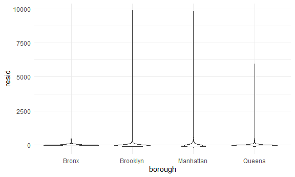

Linear Models
================

Prop test: If i have this many tests and this many samples, what is the
estimated proportion and accompanying confidence intervals

prop.test(successes,trials) gives you estimate & UL/LL of the CI

- you may need to count the \#s of homicides, aggregate total \# of
  homicides, do prop test, iterate into a function

``` r
 prop.test(5, 10)
```

    ## 
    ##  1-sample proportions test without continuity correction
    ## 
    ## data:  5 out of 10, null probability 0.5
    ## X-squared = 0, df = 1, p-value = 1
    ## alternative hypothesis: true p is not equal to 0.5
    ## 95 percent confidence interval:
    ##  0.2365931 0.7634069
    ## sample estimates:
    ##   p 
    ## 0.5

Protip – start with one city when beginning your analyses –\> then do
your functions

\##Linear Models

- FYI removed Staten Island due to being too few N for regression

``` r
data("nyc_airbnb")

nyc_airbnb = 
  nyc_airbnb %>% 
  mutate(stars = review_scores_location / 2) %>% 
  rename(
    borough = neighbourhood_group,
    neighborhood = neighbourhood) %>% 
  filter(borough != "Staten Island") %>% 
  select(price, stars, borough, neighborhood, room_type)
```

## Fit the first model

- sometimes you might want to save the equation as something more
  interpretable than “fit”
- you start plugging in the predictors as is

``` r
fit = lm(price ~ stars + borough, data = nyc_airbnb)

fit
```

    ## 
    ## Call:
    ## lm(formula = price ~ stars + borough, data = nyc_airbnb)
    ## 
    ## Coefficients:
    ##      (Intercept)             stars   boroughBrooklyn  boroughManhattan  
    ##           -70.41             31.99             40.50             90.25  
    ##    boroughQueens  
    ##            13.21

If you print the output: NOT a DF & by default just tells you the model
and coefficients

- technically sure you can do summary(fit)\$coef you could get some
  coefficients….but guess what is better:

- get your dataframe

``` r
fit %>% 
  broom::tidy() %>%
  mutate(
    term = str_replace(term, "borough", "Borough: ")
  ) %>% 
  select(term, estimate, p.value) %>% 
  knitr::kable(digits = 2)
```

| term               | estimate | p.value |
|:-------------------|---------:|--------:|
| (Intercept)        |   -70.41 |    0.00 |
| stars              |    31.99 |    0.00 |
| Borough: Brooklyn  |    40.50 |    0.00 |
| Borough: Manhattan |    90.25 |    0.00 |
| Borough: Queens    |    13.21 |    0.15 |

- notice how it has created Bronx as the reference group
- How can you change the reference group?

Notice that borough = character variable Let’s change it up!

Well, first you have to prepare fit if the first thing is not a
dataframe because it wants to create it

``` r
fit = 
  nyc_airbnb %>% 
  lm(price ~ stars + borough, data = .)
```

So to actually change it:

*figure out why he had the stars transformation*

fct_infreq = most common frequency –\> sets the most common as level 1
Whatever is factor level 1 becomes the reference group

- broom::glance() is excellent for Rsquared and adjusted square
- AND it’s a dataframe

``` r
fit = 
  nyc_airbnb %>% 
  mutate(
    borough = fct_infreq(borough)
  ) %>% 
  lm(price ~ stars + borough, data = .)

fit %>% 
    broom::tidy() %>%
  mutate(
    term = str_replace(term, "borough", "Borough: ")
  ) %>% 
  select(term, estimate, p.value) %>% 
  knitr::kable(digits = 2)
```

| term              | estimate | p.value |
|:------------------|---------:|--------:|
| (Intercept)       |    19.84 |     0.1 |
| stars             |    31.99 |     0.0 |
| Borough: Brooklyn |   -49.75 |     0.0 |
| Borough: Queens   |   -77.05 |     0.0 |
| Borough: Bronx    |   -90.25 |     0.0 |

``` r
fit %>% 
  broom::glance() %>% 
  select(AIC)
```

    ## # A tibble: 1 × 1
    ##       AIC
    ##     <dbl>
    ## 1 404237.

## Diagnostics

- yes, always do this

- getting residuals

- pckge asks what dataset did you get models

add_residuals(dataset, linearmodel)

``` r
modelr::add_residuals(nyc_airbnb, fit)
```

    ## # A tibble: 40,492 × 6
    ##    price stars borough neighborhood room_type        resid
    ##    <dbl> <dbl> <chr>   <chr>        <chr>            <dbl>
    ##  1    99   5   Bronx   City Island  Private room      9.47
    ##  2   200  NA   Bronx   City Island  Private room     NA   
    ##  3   300  NA   Bronx   City Island  Entire home/apt  NA   
    ##  4   125   5   Bronx   City Island  Entire home/apt  35.5 
    ##  5    69   5   Bronx   City Island  Private room    -20.5 
    ##  6   125   5   Bronx   City Island  Entire home/apt  35.5 
    ##  7    85   5   Bronx   City Island  Entire home/apt  -4.53
    ##  8    39   4.5 Bronx   Allerton     Private room    -34.5 
    ##  9    95   5   Bronx   Allerton     Entire home/apt   5.47
    ## 10   125   4.5 Bronx   Allerton     Entire home/apt  51.5 
    ## # … with 40,482 more rows

``` r
modelr::add_residuals(nyc_airbnb, fit) %>% 
  ggplot(aes(x = stars, y = resid)) + 
  geom_point()
```

    ## Warning: Removed 9962 rows containing missing values (geom_point).


…constant variance assumption doesn’t work here (gets more variance in 5
if you are doing H0 then you have to worry about constant maybe you want
to exclude some outliers)

Before you fit any models - inspect - after you do that, inspect again

``` r
nyc_airbnb %>% 
  modelr::add_residuals(fit) %>% 
  ggplot(aes(x = borough, y = resid)) + geom_violin()
```

    ## Warning: Removed 9962 rows containing non-finite values (stat_ydensity).



## Hypothesis testing

one coefficient (let’s say stars)

``` r
fit_null = lm(price ~ stars + borough, data = nyc_airbnb)
fit_alt = lm(price ~ stars + borough + room_type, data = nyc_airbnb)

fit %>% 
  broom::tidy()
```

    ## # A tibble: 5 × 5
    ##   term            estimate std.error statistic   p.value
    ##   <chr>              <dbl>     <dbl>     <dbl>     <dbl>
    ## 1 (Intercept)         19.8     12.2       1.63 1.04e-  1
    ## 2 stars               32.0      2.53     12.7  1.27e- 36
    ## 3 boroughBrooklyn    -49.8      2.23    -22.3  6.32e-109
    ## 4 boroughQueens      -77.0      3.73    -20.7  2.58e- 94
    ## 5 boroughBronx       -90.3      8.57    -10.5  6.64e- 26

``` r
anova(fit_null, fit_alt) %>% 
  broom::tidy()
```

    ## Warning: Unknown or uninitialised column: `term`.

    ## # A tibble: 2 × 7
    ##   term                              df.re…¹    rss    df   sumsq stati…² p.value
    ##   <chr>                               <dbl>  <dbl> <dbl>   <dbl>   <dbl>   <dbl>
    ## 1 price ~ stars + borough             30525 1.01e9    NA NA          NA       NA
    ## 2 price ~ stars + borough + room_t…   30523 9.21e8     2  8.42e7   1394.       0
    ## # … with abbreviated variable names ¹​df.residual, ²​statistic

## Interactions…?

Room type by borough: multiplying factor variables by factor variables

- in a lot of cases exploratory analyses is good enough
- more formally you should create hypothesis testing

``` r
nyc_airbnb %>% 
  lm(price ~ stars * borough + room_type * borough, data = .) %>% 
  broom::tidy() %>% 
  knitr::kable(digits = 3)
```

| term                                   | estimate | std.error | statistic | p.value |
|:---------------------------------------|---------:|----------:|----------:|--------:|
| (Intercept)                            |   90.067 |    75.406 |     1.194 |   0.232 |
| stars                                  |    4.446 |    16.633 |     0.267 |   0.789 |
| boroughBrooklyn                        |  -20.439 |    77.117 |    -0.265 |   0.791 |
| boroughManhattan                       |    5.627 |    77.808 |     0.072 |   0.942 |
| boroughQueens                          |    1.509 |    83.501 |     0.018 |   0.986 |
| room_typePrivate room                  |  -52.915 |    17.751 |    -2.981 |   0.003 |
| room_typeShared room                   |  -70.547 |    41.551 |    -1.698 |   0.090 |
| stars:boroughBrooklyn                  |   16.525 |    16.982 |     0.973 |   0.331 |
| stars:boroughManhattan                 |   22.664 |    17.099 |     1.325 |   0.185 |
| stars:boroughQueens                    |    5.208 |    18.272 |     0.285 |   0.776 |
| boroughBrooklyn:room_typePrivate room  |  -39.308 |    18.024 |    -2.181 |   0.029 |
| boroughManhattan:room_typePrivate room |  -71.273 |    18.002 |    -3.959 |   0.000 |
| boroughQueens:room_typePrivate room    |  -16.341 |    19.020 |    -0.859 |   0.390 |
| boroughBrooklyn:room_typeShared room   |  -35.292 |    42.942 |    -0.822 |   0.411 |
| boroughManhattan:room_typeShared room  |  -83.089 |    42.451 |    -1.957 |   0.050 |
| boroughQueens:room_typeShared room     |  -24.427 |    44.399 |    -0.550 |   0.582 |

So… can we fit models by borough…?

at that stage, called my column “df” that has datasets pull models is a
list of linear models!

``` r
nyc_airbnb %>% 
  nest(df = -borough) %>% 
 mutate(
    models = map(data, ~lm(price ~ stars + room_type, data = .x)),
    results = map(models, broom::tidy)) %>% 
  select(borough, results) %>% 
  pull(models)
```
