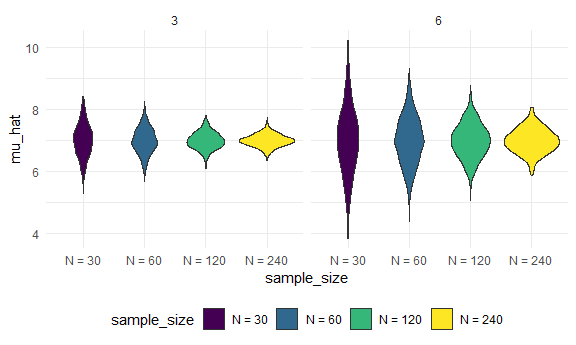

Cross Validation
================

\##Simulations

Here’s our function from before.

mu = true_mean sigma = std_dev

rnorm: generate a random dataset from a normal distribution in which the
true mean is defined as is the standard deviation

the dataset sample produces the estimated mean and estimated st dev

``` r
sim_mean_sd = function(n_obs, mu = 7, sigma = 4) {

  x = rnorm(n_obs, mean = mu, sd = sigma)

tibble(
  mu_hat = mean(x),
  sigma_hat = sd(x)
)

}
```

How did we use this before? - you can run/rerun the code –\> will be
approximately the true mu and sigma - everytune = 1 manual rerun

``` r
sim_mean_sd(n_obs = 30)
```

    ## # A tibble: 1 × 2
    ##   mu_hat sigma_hat
    ##    <dbl>     <dbl>
    ## 1   7.33      3.70

*Okay, let’s scale this up.*

- `Forloop`

output = vector(“list”, length = 100) –\> created an output vector with
a 100 empty spots

ran the sim_mean_sd function 100 x w/ number of output = 30

saved each results as an output —\> binded rows

``` r
output = vector("list", 100)

for (i in 1:100) {
  output[[i]] = sim_mean_sd(n_obs = 30)
}

sim_results = bind_rows(output)
```

### You could also use a dataframe leveraging list columns ti keep track

- we saw in listcols_df_complete how these might be done using
  map(function, data) where each row of the data was distinct

here, the input/x = a constant

*Why use expand grid* - give me all psoitive combos given this input -
in this case leveraged because I wanted a copy of all samples that are
being worked on - this is the differentiator in which you actually
created the dataframe to begin with whereas before there was an existing
dataframe - the dataframe is “built” different - I want an input column
that is the SAME everywhere - keeps track of which iteration you are on
and which variable to use

*map(input_name, function)* - notice that here the input is a constant -
shorter line of code

``` r
sim_results_df = 
  
  expand_grid(
    sample_size = 30, 
    iteration = 1:100
) %>% 
  mutate(
    estimate_df = map(sample_size, sim_mean_sd)
  )
```

*you might want to unnest the dataframe*

- so you can have for the first sample size, you can uncollapse the
  tibble that is produced by the function & have mu-hat and sigma-hat
  appear
- you can now work with your dataframe!

``` r
sim_results_df = 
  expand_grid(
    sample_size = 30,
    iter = 1:100
  ) %>% 
  mutate(
    estimate_df = map(sample_size, sim_mean_sd)
  ) %>% 
  unnest(estimate_df)
```

FYI you could have said: .x = sample_size, \~sim_mean_sd(n_obs = .x)

The tilde means that I’m telling you to put it INTO here

purr package = .x and .y are CUMPOLSORY you should not have anywhere
else called .x or .y

*What does map allow us to do:* - take the first element and apply that
function and do it all subsequently

*sim_results_df*

- when I gnenerate a 100 datasets, with a true mean of X and a sample
  mean will vary over time

``` r
sim_results_df %>% 
  ggplot(aes(x = sample_size, y = mu_hat)) + 
  geom_violin()
```


``` r
sim_results_df %>% 
  ggplot(aes(x = mu_hat)) + 
  geom_density()
```


- above is a distribution of sample means when you generated 100
  datasets with a true mean of 7 and sdev of 4 from a normally
  distributed sample

- average sample mean and standard error should = the mu-hat / sqrt(n)
  *you can test this!*

- AKA you can now test to see if the sample average looks like what it
  is supposd to do

- you could do binorm not rnorm (how big does the sample n have to be
  for you to make CLT work)

- CLT applications

## Change the sample size

- Can you model what happens when your sample size gets bigger?
- see CLT formula
- when you map across that sample size column you gor row by row and
  compute the mean

I need an input list with lots of sample sizes - mutate function will
apply row by row

``` r
sim_results_df = 
  expand_grid(
    sample_size = c(30, 60, 120, 240),
    iter = 1:100
  ) %>% 
  mutate(
    estimate_df = map(sample_size, sim_mean_sd)
  ) %>% 
  unnest(estimate_df)
```

*We can now SEE what is the distribution*

FYI violin plot assumes x axis to not be a number Therefore: convert to
number

fct inorder = sample size as it appears in my df = command

``` r
sim_results_df %>% 
  mutate(
    sample_size = str_c("N = ", sample_size),
    sample_size = fct_inorder(sample_size)
  ) %>% 
  ggplot(aes(x = sample_size, y = mu_hat)) + 
  geom_violin()
```


``` r
sim_results_df %>% 
  mutate(
    sample_size = str_c("N = ", sample_size),
    sample_size = fct_inorder(sample_size)
  ) %>%
  group_by(sample_size) %>% 
  summarize(
    emp_st_err = sd(mu_hat)
  )
```

    ## # A tibble: 4 × 2
    ##   sample_size emp_st_err
    ##   <fct>            <dbl>
    ## 1 N = 30           0.617
    ## 2 N = 60           0.487
    ## 3 N = 120          0.370
    ## 4 N = 240          0.260

emp_st_err = empirical standard error \~ true st error = true_mean/
sqrt(n_obs) - tested each one manually – proven to be approximately
close!

## CHANGE 2 inputs: You can also test to see what happens when you vary sigma

- added a new combinatrice – 6, 3
- how do i map over 2 inputs –\> map2
- make sure to make explicit how the function should be mapped using the
  syntax of the function:

sim_mean_sd = function(n_obs, mu = 7, sigma = 4)

- if mapping implicitly:

position matters: figure out which parameter goes to which place: n_obs
= 1st position mu = 2nd position sigma = 3rd posiiton

if you are not explicit it will assume the 1st position variable is
being efined \* applies to map as well

- yes you have to name the tilde – take the .x and make it show up over
  here (lol, syntax)

- . x an . y are compulsory

map(.x = sample_size, \~sim_mean_sd(n_obs = .x))

``` r
sim_results_df = 
  expand_grid(
    sample_size = c(30, 60, 120, 240),
    true_sigma = c(6, 3),
    iter = 1:1000
  ) %>% 
  mutate(
    estimate_df = 
      map2(.x = sample_size, .y = true_sigma, ~sim_mean_sd(n_obs = .x, sigma = .y))
  ) %>% 
  unnest(estimate_df)
```

Above you see that the syntax is map2 = function ONLY for two arguments;
notice that you have to do it explicitly

*power of simulations is that you can model and test theories etc*

``` r
sim_results_df %>% 
  mutate(
    sample_size = str_c("N = ", sample_size),
    sample_size = fct_inorder(sample_size)) %>% 
  ggplot(aes(x = sample_size, y = mu_hat, fill = sample_size)) + 
  geom_violin() + 
  facet_grid(. ~ true_sigma)
```


For any true sigma, (3 or 6), increasing the sample n narrows the
distribution in a way that corresponds to the sqrt (n_obs). from 3 to 6
everything gets about 2x as wide

*Concluding tips*

- start with a smaller iteration to have it run more quickly

- consider cache rmd code chunk if needed

  - save everytime but comes with a caveat
  - will not rerun unless you rerun here
  - if this code chunk is dependent on another R will not know you want
    to rerun things now that you have changed something vital upstream
